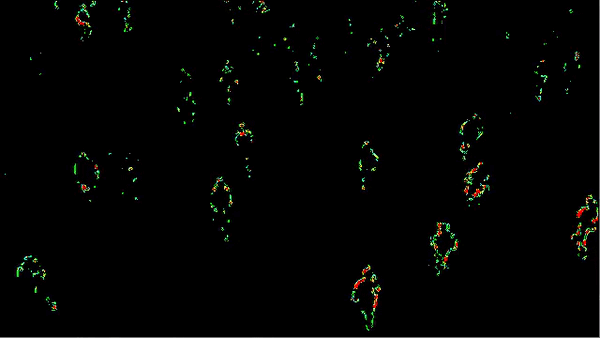

# PyCvl


[](https://github.com/breadrock1/PyCvl/actions/workflows/pull-request.yml)

### Program Description

The `PyCvl` project is a `Python` bindings based on `CVLCore` private repository which provides ability to use core `APIs` for continuous analysis of a video stream including generating `vibro-image`.

The more information you can find here [CvlDesktop](https://github.com/breadrock1/CVLDetector)

<p float="left">
  
  
</p>

### WARNING!!!

To get main library access please visit site: https://clvdetector.socialcodesoftware.co.uk/

### Cite
```
@misc{
    PyCvl,
    authors = {Artem Amentes, Gleb Akimov},
    title = {Contactless Video Lie Detector},
    year = {2023},
    publisher = {GitHub},
    journal = {GitHub repository},
    email = {artem@socialcodesoftware.co.uk,
             breadrock1@gmail.com}
}
```

### License
GNU AFFERO GENERAL PUBLIC LICENSE
